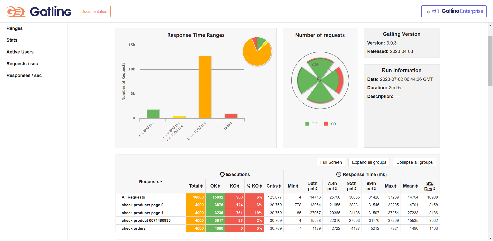
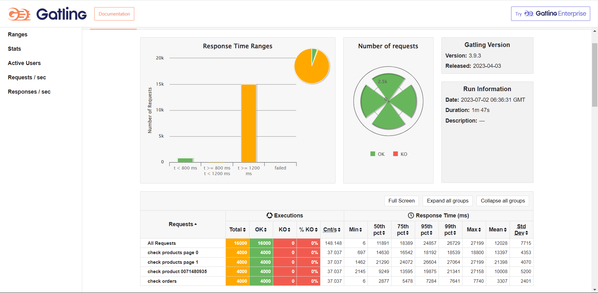

# AW09

基于 AW08 ，为 webpos 系统实现了响应式 API ，另添加了 `user-service` 微服务，用于注册用户和密码校验。

继承自先前作业的功能有：RESTful API 、处可理商品数据并写入 MySQL 数据库的 batch-server 工程、使用 RabbitMQ 与 webpos 工程交互的 delivery-server 工程。

### 微服务部分

##### 新增 API

- /users/register

Post API，传入一个 `User` 的 JSON ，`user-service` 会在用户名不重复的前提下生成一个新用户并存入 MySQL 数据库。

##### 其他变化

新增订单现在改为传入 `OrderApplication` 的 JSON ，包含用户密码和订单信息，`order-service` 会调用 `user-service` 的密码校验 API ，校验通过后才会新增订单。

查看所有商品加入了分页功能，可设置 `pageId` 和 `numPerPage` 两个参数指定页码和每页商品数量。

### 响应式 API

使用 `Mono` 和 `Flux` 做数据的异步传播和处理，可以大大提升系统性能。

#### 微服务间通信

由于原本使用的 `RestTemplate` 是阻塞式的，需要改用 `WebClient` 进行微服务间通信。

另外，响应式 API 设计下，微服务间的通信是延迟进行的，因此 Controller 返回前的 gateway 请求处理过程中，不会得知微服务是否在工作，也就不会抛出异常。因此 `CircuitBreaker` 在此设计下无法捕获到异常，已在本项目中去除。

#### 持久层框架

分别实现了使用 MyBatis 和 R2DBC 两种持久层框架的响应式 API，在微服务子工程的 `application.yml` 中设置`spring.repository.type` 的值为 `MyBatis` 或 `R2DBC` 即可更换持久层框架。

MyBatis 并不原生支持响应式 API，需要使用 `defer()` 方法创建 `Flux` 及 `Mono` 以规避，而不能使用 `just()` ，否则会在 `Flux` 或 `Mono` 生成阶段就发生阻塞。

R2DBC 对联表查询的支持较弱，这里采用了显式使用 `R2dbcEntityTemplate` 多次查询的方式完成联表查询。

以根据用户 ID 查询订单为例，使用 MyBatis 和 R2DBC 对同一接口的实现分别如下：

```Java
@Override
public Flux<Order> getOrdersByUserId(String userId) {
    return Flux.defer(
            () -> {
                List<Order> orders = null;
                try (SqlSession sqlSession = getSqlSession()) {
                    OrderMapper mapper = sqlSession.getMapper(OrderMapper.class);
                    orders = mapper.getOrdersByUserId(userId);
                } catch (Exception e) {
                    e.printStackTrace();
                }
                return orders == null ? Flux.empty() : Flux.fromIterable(orders);
            }
    );
}
```

```Java
@Override
public Flux<Order> getOrdersByUserId(String userId) {
    Flux<OrderInfo> orderInfoFlux = r2dbcEntityTemplate.select(OrderInfo.class).from("order_info")
            .matching(Query.query(Criteria.where("userId").is(userId)))
            .all();
    return assemblyOrder(orderInfoFlux);
}    

private Flux<Order> assemblyOrder(Flux<OrderInfo> orderInfoFlux) {
    Flux<List<OrderItem>> orderItemFlux = orderInfoFlux.flatMap(
            orderInfo -> r2dbcEntityTemplate.select(OrderDetail.class).from("order_detail")
                    .matching(Query.query(Criteria.where("orderId").is(orderInfo.getOrderId())))
                    .all().map(
                            orderDetail -> new OrderItem(orderDetail.getAsin(), orderDetail.getNum())
                    ).collectList()
    );
    return orderItemFlux.zipWith(orderInfoFlux,
            (orderItems, orderInfo) -> new Order(orderInfo.getOrderId(), orderInfo.getUserId(), orderItems)
    );
}
```

### 性能测试

测试平台：

- 操作系统：Windows 10

- CPU：Intel(R) Core(TM) i7-10750H 6核
- 内存：16G 2933Hz
- SSD：KXG60ZNV512G KIOXIA

所有微服务各启动一个，均运行在真机上。

使用 Gatling 对系统进行测试，模拟用户操作的脚本唯于 webpos-api-gateway 工程的 resouces 目录下。测试并发数为 2000，重复2次，另外由于服务初次启动时性能表现较差，以下测试结果均为性能稳定时的结果。

使用 MyBatis 和 R2DBC 的测试结果分别如下：





均基本通过了测试。MyBatis 对于请求较少的测试前期响应速度较快（表现在t < 800ms 占比），但是高并发场景下不稳定，会产生少量 KO；R2DBC 在高并发下能稳定地完成所有请求的处理，无 KO。

作为对比，AW08 的系统在这种规模的并发下会立即崩溃，完全无法正常工作。